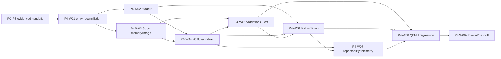

# Rust Type-1 Hypervisor — P4 Stage Task Book v0.1

**Stage ID:** P4
**Stage name:** Stage-2 与 Rust Validation Guest v0
**Status:** Planning baseline; implementation and validation are not claimed
**Owner/change context:** P4 first controlled Guest-EL1 execution loop
**Supersedes:** the root-level `Rust Type-1 Hypervisor — P4 Stage Task Book v0.1.md` source document
**Governing documents:** [Architecture baseline ADR](../../adr/adr-000-architecture-baseline-v0.1.md), [documentation index](../../README.md), and [Plan Agent guide](../../development/plan-agent-guidelines.md)
**Upstream stages:** P0–P3
**Primary downstream stage:** P5 — Hypercall、对象句柄与 Capability v0

## 1. Purpose and boundary

P4 establishes the first complete AArch64 Host EL2 → Guest EL1 execution loop.
On the QEMU `virt` reference platform, the Hypervisor must be able to create an
independent Stage-2 address space and bounded Guest RAM for one Rust `no_std`
Validation Guest, construct one Guest-EL1 vCPU initial state, enter it with
`ERET`, observe normal execution and controlled exits, diagnose Stage-2
translation and permission faults, and retain EL2 control through repeatable
test runs.

This is a correctness and isolation stage. A successful hello marker alone is
not stage completion. The planned deliverables must prove the mapped/unmapped,
permission, Guest-fault, Hypervisor-protection, re-entry, and automated
regression properties in the validation matrix below.

### Required

- reconcile the P0–P3 entry contracts before P4 implementation starts;
- establish independent Stage-2 address-space lifecycle, map, unmap,
  read/write/execute protection, query, active-context, and current-path TLB
  consistency capabilities;
- construct bounded, initialized Guest RAM and load one repeatable Validation
  Guest image after range and overflow validation;
- prepare a reproducible single-vCPU Guest-EL1 initial state, enter and leave
  it while preserving EL2 control, and support one defined re-entry and stop
  path;
- make a Rust `no_std` Validation Guest a maintained test asset, with EL1,
  normal memory, unmapped, permission, WFI/WFE, and controlled illegal-behavior
  scenarios;
- classify and diagnose Guest exits and Stage-2 faults, keep Guest-caused
  faults separate from Hypervisor invariants, and demonstrate basic Guest
  isolation;
- demonstrate same-session and cold-boot repeatability, deterministic Guest
  memory initialization, and the required Stage-2/vCPU telemetry;
- provide automated QEMU `virt` positive, fault, recovery, and repeat
  regression coverage; and
- record implementation facts, limitations, evidence, and the P5 handoff only
  after the required work has actually been performed and verified.

### Reserved

- a single Validation Guest and temporary Validation Guest IPA layout are
  allowed for P4, but neither is a permanent one-VM architecture nor a frozen
  `rusthv-arm-virt-v1` machine ABI;
- the P3 cross-CPU transport is available for a later Stage-2 TLB shootdown;
  P4 proves current-path consistency and must not preclude multi-pCPU handling;
- dynamic VM/vCPU, memory ownership, and VMID evolution remain possible, but
  their later policy and lifecycle expansion are not delivered here;
- an ELF or flat-binary test-image route may be selected during detailed design
  and recorded as an implemented fact; this task book does not select one;
- larger-page policy, mapper concurrency, VMID allocation details, telemetry
  interface, and assembly/Rust boundary remain detailed-design choices.

### Out of scope

- a frozen HVC or management ABI, capability/handle implementation, and
  guest-safe-copy framework (P5);
- vGIC, virtual timer, physical/virtual IRQ delivery, and Guest SMP (P6+);
- run queues, preemption, M:N scheduling, affinity policy, and full lifecycle
  management (P7+);
- Linux Guest boot, formal Generic ARM64 machine type, Guest DTB, ACPI, and
  virtio (P8+);
- Control Domain, filesystem, device passthrough, IOMMU, snapshot, migration,
  COW/dirty tracking, and memory-overcommit policy; and
- huge-page, lock-free, batching, NUMA, or VMID-recycling optimization.

P4 must not introduce board-name or QEMU-name behavior into generic Core. QEMU
is the reference validation environment, not the architecture definition.

## 2. Source constraints and entry conditions

The ADR requires a Rust-first, AArch64-first Type-1 Hypervisor, treats Guest
input and Guest-caused faults as untrusted/recoverable VM-facing events, makes
Stage-2 address spaces and memory ownership first-class, requires the first
Guest to be a Rust Validation Guest at EL1 without virtual EL2, and makes
structured telemetry and QEMU integration part of engineering validation.
Core remains independent of architecture, SoC, board, and QEMU.

P4 may start implementation only when the following upstream evidence is
available. This task book records a dependency; it does not assert any upstream
stage is complete.

| Upstream | Required handoff to inspect | P4 use |
|---|---|---|
| P0 | toolchain, QEMU runner, host-side test, unsafe, diagnostics, dependency and integration governance | repeatable build/test and review baseline |
| P1 | stable AArch64 Non-secure EL2, host Stage-1, exception diagnostics, register context, panic/crash baseline | EL2 entry/exit and fault observation |
| P2 | normalized platform/memory map, Hypervisor/reserved/boot-artifact exclusion, physical page allocation/free, ownership accounting | Stage-2 backing pages and bounded Guest RAM |
| P3 | SMP-safe allocator and synchronization, logical pCPU identity, cross-CPU notification, TLB-shootdown transport, CPU-local state | no permanent single-pCPU assumption and later invalidation integration |

If an upstream handoff is absent or contradicts the needed P4 behavior, record
the blocked prerequisite or an ADR-required issue. Do not repair P0–P3 scope
inside P4.

## 3. Delivery hierarchy and package map

Read a P4 package in this order: ADR, this task book, the
[plan index](plans/README.md), its selected plan, the Coding Guide plus an
approved detailed design before code changes, then its implementation and
verification record. Plans are bounded work packages and do not define modules,
APIs, data structures, assembly boundaries, algorithms, or test results.

| Package | Required outcome | Primary validation |
|---|---|---|
| P4-W01 | P0–P3 handoffs, P4 scope, safety boundary, and evidence inputs are reconciled before implementation. | P4-V01 |
| P4-W02 | One Guest address space can be independently created/destroyed, mapped, unmapped, protected, queried, installed, and made current-path consistent. | P4-V02, P4-V07, P4-V08 |
| P4-W03 | Bounded Guest RAM and a validated, deterministically initialized Validation Guest image are prepared from safe Host memory. | P4-V03 |
| P4-W04 | One reproducible Guest-EL1 vCPU state can enter, exit, recover EL2 control, re-enter, and stop. | P4-V04, P4-V09 |
| P4-W05 | The maintained Rust Validation Guest and its explicit scenario set exercise the P4 execution boundary. | P4-V05, P4-V06, P4-V08, P4-V09 |
| P4-W06 | Guest exits, Stage-2 faults, and Guest isolation are classified and diagnosed without converting controlled Guest faults into Hypervisor panic. | P4-V06, P4-V07, P4-V08, P4-V09 |
| P4-W07 | P4 behavior is repeatable and emits required vCPU/Stage-2 telemetry and counts. | P4-V10–P4-V12 |
| P4-W08 | QEMU `virt` automated integration regression determines P4 positive, fault, recovery, and repeat outcomes. | P4-V13–P4-V15 |
| P4-W09 | Implemented facts, limitations, verification evidence, and the P5 handoff are recorded without turning temporary P4 facts into later contracts. | P4-V16 |

Every package has exactly one plan in [plans/](plans/README.md). Completion
evidence belongs in `verification/`; implementation and detailed-design records
belong in `implementation/`.

## 4. Dependency and execution map

P4-W02 and P4-W03 may proceed after P4-W01 when their individual detailed
designs establish compatible memory-ownership assumptions. All other edges are
required because they provide the behavior or evidence consumed downstream.

## 5. Requirement-to-validation traceability

| Source requirement | Planned package | Validation |
|---|---|---|
| P4-A01–A07: Stage-2 lifecycle, map/unmap/protect/query, active context, current-path TLB consistency | W02 | P4-V02, V07, V08 |
| P4-B01–B05: Guest RAM, temporary IPA layout record, image loading/bounds, deterministic initialization | W03 | P4-V03 |
| P4-C01–C04: single-vCPU state, Guest EL1, repeatable construction, EL2→EL1 transition | W04 | P4-V04 |
| P4-D01–D08 and P4-J: Rust Validation Guest and explicit scenario set | W05 | P4-V05, V06, V08, V09 |
| P4-E01–E05: first entry, exit classification, EL2 recovery, re-entry, stop | W04, W06 | P4-V04, V06, V09 |
| P4-F01–F04: translation/permission diagnosis, Guest-vs-Hypervisor fault distinction, address inspection | W06 | P4-V06, V07, V08 |
| P4-G01–G04: Hypervisor protection, Guest-RAM bounds, execute and write enforcement | W02, W06 | P4-V07, V08 |
| P4-H01–H03: same-session restart, cold-boot consistency, cleanup/initialization | W07 | P4-V10, V11 |
| P4-I01–I02: event categories, counters, and fault context | W07 | P4-V12 |
| P4-K01–K05: QEMU positive, translation, permission, survival, repeat regression | W08 | P4-V13–V15 |
| P4-L01–L03: implemented boot contract, capability matrix, known limitations | W09 | P4-V16 |

## 6. Stage validation matrix

All rows define planned evidence and objective success conditions. They are not
claims that a command has run or that an implementation exists.

| ID | Evidence sought | Success condition |
|---|---|---|
| P4-V01 | P0–P3 handoff and scope review | all entry inputs are identified, compatible, and linked; a missing input is recorded as a block rather than absorbed into P4 |
| P4-V02 | Stage-2 lifecycle and mutation tests/review | an independent address space can create/destroy, map, unmap, protect, query, and apply each mutation before later Guest execution |
| P4-V03 | Guest-memory/image negative and construction evidence | RAM originates only from allocatable pages; forbidden overlap, empty/invalid image, range overflow, invalid entry, and prohibited overwrite are rejected; initialization is deterministic |
| P4-V04 | Guest-EL1 entry/exit/re-entry evidence | correct Guest PC/SP/state reaches EL1 by `ERET`; a classified exit retains EL2 control; at least one re-entry and defined stop path succeed |
| P4-V05 | Validation Guest self-test evidence | maintained Rust `no_std` asset proves EL1, code execution, mapped RAM read/write, and stack use |
| P4-V06 | Exit and fault diagnostic evidence | expected trap, translation fault, permission fault, WFI/WFE-related behavior, and unknown synchronous exception are distinguishable with Guest/vCPU, PC, IPA, access, and state context |
| P4-V07 | Isolation negative-test evidence | unmapped IPA, Guest-RAM-boundary, and selected Hypervisor-owned-range accesses are blocked by Stage-2 and leave EL2 diagnostically live |
| P4-V08 | Permission negative-test evidence | a read-only write and an execute-permission comparison are controlled and distinguishable; the required P4 capability does not rely on stale translations |
| P4-V09 | Controlled Guest-fault and WFI/WFE evidence | a Guest illegal behavior remains VM-facing rather than a Hypervisor fatal fault; WFI or WFE receives a defined diagnosable result |
| P4-V10 | Same-session lifecycle evidence | create → run → stop → reinitialize → run again does not rely on prior Guest RAM or global CPU residue |
| P4-V11 | repeated cold-boot evidence | repeated QEMU boots yield consistent entry, Stage-2, and fault-syndrome results within the declared test environment |
| P4-V12 | telemetry/metric evidence | VM creation/memory assignment, Stage-2 mutation, vCPU enter/exit/stop, and translation/permission fault events are observable; required counts and fault correlations are available |
| P4-V13 | automated QEMU positive-path result | automation builds the Hypervisor and Guest, prepares the image, boots QEMU, recognizes the EL1 success marker, and returns a determinate result |
| P4-V14 | automated QEMU fault/recovery result | automation recognizes translation and permission faults plus the defined EL2-survival or Guest-stopped result |
| P4-V15 | automated QEMU repeat result | the same declared build executes multiple integration iterations with stable, determinate results |
| P4-V16 | closeout and handoff review | implementation facts, boot contract, capability matrix, limitations, unsafe inventory updates, evidence locations, and P5 inputs are recorded; unimplemented scope remains explicit |

The Validation Guest suite must include VG-001 through VG-012 from the source
task book. VG-001–VG-007, VG-010, and VG-012 are mandatory P4 scenarios.
VG-008, VG-009, and VG-011 are planned P4 scenarios and may only be deferred by
an explicit stage-review record that identifies the AArch64-specific reason,
the downstream owner, and the resulting exit-criterion effect.

## 7. Exit criteria and P5 handoff

P4 can close only when P4-V01 through P4-V16 have real evidence and all of the
following are true:

1. Stage-2 address-space lifecycle, mapping, unmapping, permission, query,
   context installation, and current-path invalidation behavior are evidenced.
2. Guest RAM and image loading are bounded, ownership-aware, initialized, and
   protected from forbidden Host ranges.
3. A Rust Validation Guest reliably enters EL1, executes, exits, re-enters, and
   stops while EL2 remains live and diagnosable.
4. Translation, permission, bounds, and Hypervisor-memory negative cases are
   contained as Guest-facing events with required diagnostics.
5. Required telemetry, repeatability, and QEMU automated-regression evidence
   exists in the appropriate verification records.
6. The Validation Guest boot contract, Stage-2 capability matrix, known
   limitations, unsafe inventory delta, and any ADR deviations are factual and
   linked. No plan or completion record silently freezes the P8 machine ABI.

P5 may rely only on proven P4 facts: a usable single-Guest/vCPU execution
boundary, Stage-2 isolation and fault classification, bounded Guest memory and
image path, the maintained Validation Guest, and QEMU regression entry points.
P5 must not have to re-establish EL2→EL1 entry or basic Stage-2 fault capture;
it still owns formal HVC ABI, capabilities, object handles, and management
semantics.

## 8. Open planning classifications

| Topic | Classification | Required handling |
|---|---|---|
| image format and loading route | Implementation Choice | choose in approved detailed design and record the implemented boot contract |
| temporary Validation Guest IPA values | Implementation Choice | document only as a P4 test contract; do not represent them as P8 machine ABI |
| Stage-2 page-table representation, mapping algorithm, locking, VMID allocation, and assembly boundary | Implementation Choice | resolve in approved P4 detailed design under ADR constraints |
| difference between QEMU behavior and AArch64 architectural semantics | Specification Investigation | cite applicable architecture/specification basis; do not let QEMU define Core semantics |
| missing P0–P3 prerequisite contract or contradictory memory/SMP handoff | Architecture Change Request / ADR Required | stop the affected decision and record the conflict |
