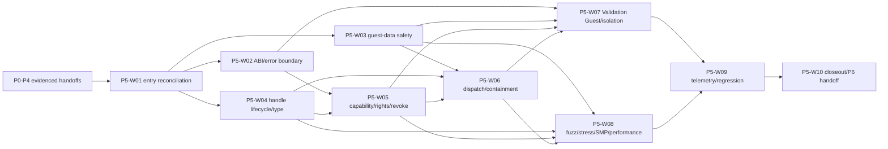

# Rust Type-1 Hypervisor — P5 Stage Task Book v0.1

**Stage ID:** P5
**Stage name:** Hypercall, object handles, and Capability v0
**Status:** Planning baseline; implementation and validation are not claimed
**Owner/change context:** P5 planning reorganization from the root-source task book
**Supersedes:** the root-level `Rust Type-1 Hypervisor — P5 Stage Task Book v0.1.md` source layout
**Governing documents:** [Architecture baseline ADR](../../adr/adr-000-architecture-baseline-v0.1.md), [documentation index](../../README.md), [ABI contract index](../../abi/README.md), [security index](../../security/README.md), and [Plan Agent guide](../../development/plan-agent-guidelines.md)
**Upstream stage:** P4 — Stage-2 and Rust Validation Guest v0
**Primary downstream stage:** P6 — Timer, GICv3, and virtual interrupts v0
**Scope:** AArch64-first; QEMU `virt` reference environment; Rust AArch64 Validation Guest

## 1. Purpose and stage boundary

P5 turns P4's Guest-EL1-to-EL2 trap boundary into a versioned, validated, and
authorization-controlled Guest-to-Hypervisor service boundary. Its required
outcome is that an untrusted Guest can discover and issue an allowed minimal
hypercall using explicitly granted authority, while malformed, forged, stale,
wrong-type, out-of-range, revoked, or cross-VM requests receive a controlled
result without violating Hypervisor memory, object, or authority boundaries.

The stage covers the complete chain:

```text
Validation Guest -> controlled HVC -> request validation -> guest-data boundary
-> opaque object reference -> caller-associated capability/right check
-> allowed operation or structured denial
```

P5 is not a Control Domain or a general management plane. It does not make the
temporary P4 Validation Guest contract into a permanent Guest machine ABI.

### Required

- reconcile P0–P4 handoffs, especially P4's proven Guest-EL1 execution,
  Stage-2 fault, Guest-memory, diagnostics, Validation Guest, and QEMU
  regression facts, before dependent P5 work starts;
- establish an AArch64 HVC ABI v0 boundary with discovery, version-compatibility,
  request/result semantics, reserved-field treatment, unknown/unsupported and
  malformed-request behavior (P5-T01);
- validate every Guest-controlled call number, version, flag, length, state,
  object reference, authority request, and checked range before an operation
  executes (P5-T02, T13, T14);
- establish a safe Guest-data access boundary: Guest pointers are never Host
  pointers; IPA/range/mapping/access/overflow/partial-mapping cases are
  explicitly controlled (P5-T03);
- establish opaque handles with existence, lifecycle, stale-reference, and
  object-type protection; a handle identifies an object but grants no authority
  by itself (P5-T04–T06);
- establish Capability v0 with caller association, operation-level rights,
  explicit bootstrap grants, permission checks, and a grant/use/revoke/reject
  loop. Fixed VM identity, first-VM status, and role are not authority
  shortcuts (P5-T07–T12);
- distinguish Guest-caused rejection from a Hypervisor invariant failure;
  malformed requests must remain a Guest-facing controlled outcome (P5-T13–T14);
- extend the Validation Guest suite, host-side validation/fuzz basis, lifecycle
  stress, two-context isolation, and multi-pCPU safety evidence for the P5
  boundary (P5-T15–T19);
- provide P5 telemetry and a safe logging boundary, establish the long-term
  regression set, record an initial performance baseline, and deliver the
  required ABI/handle/capability/input-safety/security documentation only as
  factual implementation outputs (P5-T20–T25); and
- record implementation facts, evidence, limitations, unsafe-inventory delta,
  and the P6 handoff only after the planned work has been performed and
  verified.

### Reserved

- future object classes, including interrupt, virtual-IRQ, Endpoint,
  Notification, SharedRegion, device, memory, and service objects, must be able
  to enter the same object-reference and authorization model;
- future delegation, attenuation, derived-capability, and revocation-tree
  semantics; P5 proves only the basic grant/check/revoke loop;
- later scheduling may change pCPU placement, so P5 cannot assume a caller is
  permanently bound to one pCPU;
- the same foundation may serve Linux Guests, native management, and later IPC,
  but their protocols and policies remain separately versioned work; and
- implementation choices for HVC immediate use, register allocation, binary
  encodings, object-table representation, locking, quotas, error numbers,
  fuzz harnesses, telemetry transport, and benchmark methodology.

### Out of scope

- a complete Control Domain, user authentication, passwords, TLS/certificates,
  RBAC database, persistent authorization store, or policy broker;
- a complete delegation/revocation graph, Endpoint/Notification/SharedRegion
  IPC, generic management RPC, libvirt, cross-VM service protocol, or dynamic
  VM configuration API;
- virtual timer/GIC/IRQ delivery, virtio, Linux boot, Guest DTB/ACPI, vCPU
  scheduling, affinity policy, IOMMU/device assignment, snapshot, migration,
  COW, overcommit, or a frozen `rusthv-arm-virt-v1` machine ABI; and
- a final high-performance lock/index/allocator strategy or performance KPI.

P5 must preserve Core/Arch/SoC/Board layering. Core cannot branch on QEMU or a
board name, and QEMU results do not define AArch64 architectural semantics.

## 2. Authority, ABI, security, and entry conditions

ADR-007 treats Guest register values, hypercall buffers, and object requests as
untrusted. ADR-013 requires capability/handle plus rights and generation and
forbids `vm_id == 0` authority. ADR-018 requires ownership-aware address-space
evolution; ADR-034 reserves the native primitive set; ADR-036 and ADR-040 keep
management and machine ABI versioning distinct. ADR-048 and ADR-049 require
structured observability and layered validation.

The P5 source task book calls for a formal Hypercall ABI v0 and ABI documents.
Those documents are **implementation-stage deliverables** under `docs/abi/`,
created only after an approved detailed design and compatibility analysis. This
task book and its work-package plans neither freeze nor design HVC registers,
wire encoding, numeric errors, handle layout, rights bitset, object table,
module/API boundary, or ABI compatibility promise.

P5 implementation may begin only after a P4 review identifies evidence for, or
records absence of, all of these inputs. Planning this dependency is not a
completion claim.

| Upstream | Required handoff to inspect | P5 use |
|---|---|---|
| P0 | toolchain, host-test/QEMU runner, diagnostic, unsafe, dependency, documentation, and integration governance | reproducible validation and controlled low-level review |
| P1 | stable AArch64 Non-secure EL2 and synchronous-exception context | recognize and preserve the Guest-to-EL2 trap boundary |
| P2 | protected-memory exclusion, allocation/ownership accounting, checked-address conventions | constrain safe Guest-data inspection without exposing Host memory |
| P3 | pCPU identity, synchronization rules, cross-CPU transport, SMP audit and observability inputs | avoid a permanent single-pCPU object/authority assumption |
| P4 | Guest EL1 entry/exit, HVC/exception classification, Stage-2 query/fault isolation, bounded Guest memory, Validation Guest, telemetry and QEMU evidence | build P5 only on evidenced execution and fault facts |

Absent or contradictory inputs are blocked prerequisites or `Architecture Change
Request` / `ADR Required` issues. P5 must not repair upstream scope or silently
choose a conflicting ABI/security model.

## 3. Delivery hierarchy and package map

Read a package in this order: ADR, this task book, [plan index](plans/README.md),
selected plan, the Coding Guide plus an approved detailed design before code,
then implementation and verification records. Plans do not define modules,
APIs, types, layouts, register assignments, algorithms, locks, test results,
or completed ABI contracts.

| Package | Required outcome and source-task coverage | Primary validation |
|---|---|---|
| P5-W01 | Reconciled P0–P4 entry, authority/security boundary, ABI/contract routing, and P5 evidence inputs. | P5-V01 |
| P5-W02 | Planned Hypercall ABI v0 semantic boundary, compatibility/error/fault classifications, and required documentation route without freezing its design. | P5-V02, V06, V15 |
| P5-W03 | Safe Guest-data parameter boundary for checked IPA/range/access/overflow/partial-map cases. | P5-V03 |
| P5-W04 | Opaque handle identity, object lifecycle, stale-reference and type-safety boundary. | P5-V04, V05 |
| P5-W05 | Capability v0, operation-level rights, explicit bootstrap grants, no-identity-shortcut rule, checks, and basic revocation. | P5-V06–V08 |
| P5-W06 | P5 dispatch integration and controlled containment of Guest-caused failures versus invariant failures. | P5-V09, V10 |
| P5-W07 | Validation Guest security scenarios and two-context cross-VM capability-isolation evidence. | P5-V11, V12 |
| P5-W08 | Host-side malformed-input/fuzz basis, lifecycle stress, multi-pCPU safety review/test, and performance-baseline plan. | P5-V13, V14 |
| P5-W09 | Telemetry, safe diagnostic/logging boundary, and P4/P5 regression integration. | P5-V15, V16 |
| P5-W10 | Factual closeout, implementation-deliverable documentation, evidence index, limitations, and P6 handoff. | P5-V17 |

Every package has exactly one plan in [plans/](plans/README.md). Implementation
and approved detailed-design records belong in `implementation/`; real commands,
environments, logs, results, and completion evidence belong in `verification/`.

## 4. Dependency and execution map



W02, W03, and W04 may proceed after W01 when their approved detailed designs
remain compatible. W05 depends on both ABI/error routing and handle semantics;
W06 is the first integrated service boundary. The graph is directed and
acyclic.

## 5. Requirement-to-validation traceability

| Source requirements | Planned packages | Validation |
|---|---|---|
| P5-T01, P5-T13, P5-T14: ABI boundary, discovery/compatibility, error categories, Guest versus invariant failure | W02, W06 | P5-V02, V06, V09, V10, V15 |
| P5-T02, P5-T03: request legality and safe Guest-data access | W03, W06 | P5-V03, V09, V10, V13 |
| P5-T04, P5-T05, P5-T06: opaque handle, lifecycle/stale protection, object type safety | W04 | P5-V04, V05, V11, V13 |
| P5-T07, P5-T08, P5-T09, P5-T10, P5-T11, P5-T12: Capability, rights, bootstrap grant, no VM-ID authority, check, revoke | W05, W06 | P5-V06–V08, V11–V14 |
| P5-T15, P5-T18: Validation Guest scenarios and two-context isolation | W07 | P5-V11, V12 |
| P5-T16, P5-T17, P5-T19 and §32: fuzz/property path, lifecycle stress, SMP readiness, performance baseline | W08 | P5-V13, V14 |
| P5-T20, P5-T21, P5-T25: telemetry, logging boundary, long-term regression | W09 | P5-V15, V16 |
| P5-T22, P5-T23, P5-T24, P5-D01–D09, exit documentation | W02–W05, W09–W10 | P5-V17 |
| P5 minimum closed loop and EC-P5-01–EC-P5-12 | W06–W10 | P5-V09–V17 |

## 6. Stage validation matrix

All rows state planned evidence and objective conditions. They do not claim
that implementation or a test run exists.

| ID | Evidence sought | Success condition |
|---|---|---|
| P5-V01 | P0–P4 handoff and contract-routing review | every input, consumer, evidence location or absence, ABI/security route, and conflict is identified; no undocumented P4 behavior is assumed. |
| P5-V02 | ABI-boundary and compatibility review/test | discovery, compatible/unsupported/version-mismatch/unknown/malformed semantics are documented and implemented only through the approved ABI artifact; additions do not silently redefine an established supported call. |
| P5-V03 | Guest-data boundary normal/negative evidence | zero, maximum, cross-page, partial/unmapped, read-only-write, invalid-type, and overflowing ranges receive a controlled result and never become unchecked Host access. |
| P5-V04 | Handle identity/lifecycle evidence | random, zero/max, invalid-generation, destroyed, repeated-destroy, and slot-reuse stale references remain invalid and do not expose Host pointers. |
| P5-V05 | Object-type safety evidence | an existing handle supplied where another object class is required is rejected with a defined outcome and cannot be misinterpreted. |
| P5-V06 | Rights/check/error evidence | allowed calls succeed; invalid object, absent caller authority, insufficient rights, unsupported operation, bad state, and resource conditions are distinguishable controlled outcomes. |
| P5-V07 | Bootstrap/no-identity-shortcut review | authority is explicitly granted by the Hypervisor/test bootstrap; no fixed VM ID, first-VM, or role bypass authorizes an operation. |
| P5-V08 | Basic revocation evidence | grant, valid use, revoke, and rejection of the formerly valid authority are observable; no delegation tree is implied. |
| P5-V09 | Integrated valid-HVC evidence | the defined minimal allowed HVC validates ABI, caller, object, type, rights, and arguments before producing its structured result. |
| P5-V10 | Guest-fault containment evidence | malformed calls, flags, lengths, addresses, object values, and illegal state stay Guest-facing or trigger the declared VM-facing outcome; they do not cause an unexplained Hypervisor panic. |
| P5-V11 | Validation Guest security-suite evidence | valid, invalid, stale, wrong-type, revoked, no-right, overflow, unmapped, and repeated-state scenarios have determinate expected markers. |
| P5-V12 | Two-context isolation evidence | one Validation VM/security context cannot use another's raw capability or authority despite knowing its value. |
| P5-V13 | Host-side fuzz/property and lifecycle-stress evidence | randomized/boundary parsing, ranges, handles, rights, and create/lookup/destroy/recreate sequences preserve stated invariants without panic, corruption, or stale acceptance. |
| P5-V14 | Multi-pCPU and performance-baseline evidence | declared multi-pCPU QEMU/concurrency scenarios preserve object and authority state; baseline measurements cover minimal call, handle lookup, authority check, and Guest-data validation without claiming a performance KPI. |
| P5-V15 | Telemetry/log/ABI-security-document review | required per-VM result categories are observable, diagnostics avoid default Host-pointer/Guest-buffer disclosure, and required ABI/security documents are factual implementation artifacts with compatibility analysis. |
| P5-V16 | Regression evidence | P4 EL1/Stage-2 cases and all listed P5 valid/invalid HVC, handle, authority, revoke, address, overflow, and fuzz-smoke cases return determinate outcomes in the declared environment. |
| P5-V17 | Closeout and P6-consumer review | implementation facts, validation evidence, unsafe delta, dependencies, limitations, performance record, documentation links, and P6 inputs are traceable; unimplemented work remains explicit. |

The permanent security-invariant set to preserve in implementation and
regression is INV-P5-01, INV-P5-02, INV-P5-03, INV-P5-04, INV-P5-05,
INV-P5-06, INV-P5-07, INV-P5-08, INV-P5-09, and INV-P5-10 from the source task
book: no Host pointer via hypercall; checked Guest addresses; invalid/stale/
wrong-type handle rejection; rights, cross-VM, and revoke enforcement;
malformed-request containment; and no VM-ID-derived authority. Its concrete
wording belongs in the P5 factual security deliverable after implementation.

## 7. Exit criteria and P6 handoff

P5 may close only with real evidence for P5-V01 through P5-V17 and all source
exit criteria EC-P5-01, EC-P5-02, EC-P5-03, EC-P5-04, EC-P5-05, EC-P5-06,
EC-P5-07, EC-P5-08, EC-P5-09, EC-P5-10, EC-P5-11, and EC-P5-12: formal
versioned ABI artifact; safe Guest parameters; lifecycle and type-safe handles;
capability/right enforcement without VM-ID privilege; cross-VM isolation; basic
revocation; fault containment; fuzz/negative testing; multi-pCPU evidence;
preserved P4 regression; and complete factual documentation.

At closure, the P6 handoff may rely only on evidenced P5 facts: a maintained
minimal HVC boundary, explicit caller-associated authority, extensible object
reference/right semantics, controlled Guest-data validation, structured denial
and failure classification, documented logging/telemetry constraints, and
repeatable regression entry points. P6 may introduce interrupt and virtual-IRQ
objects through this foundation but must separately design their semantics.

P5 does not hand off a frozen management ABI, a machine ABI, a Control Domain,
IPC, delegation tree, scheduler policy, final concurrent algorithm, or a claim
of real-hardware correctness. ABI and security documents must distinguish an
experimental internal compatibility commitment from any later public contract.

## 8. Open planning classifications

| Topic | Classification | Required handling |
|---|---|---|
| HVC register/call-number/error-number encoding, discovery representation, reserved-field policy, and ABI compatibility commitment | Implementation Choice subject to ABI review | select only in approved detailed design; publish the factual ABI artifact with compatibility analysis during implementation. |
| handle/capability encoding, rights representation, object-store/lifetime and revocation mechanics | Implementation Choice | preserve ADR-013 semantics and record ownership/concurrency choices in detailed design. |
| Guest-data mapping/partial-access behavior and architectural versus QEMU observations | Specification Investigation | cite the relevant AArch64 and Stage-2 basis; do not make QEMU behavior a Core contract. |
| multi-pCPU synchronization, destruction/revoke races, quotas, fuzz tooling, and performance method | Implementation Choice | document state authority, failure/recovery and evidence limits in approved detailed design. |
| P4 handoff absence/contradiction, ABI conflict, or any need to weaken capability/right/generation or VM-ID prohibition | Architecture Change Request / ADR Required | stop the affected decision and record the conflict without modifying the accepted ADR. |
