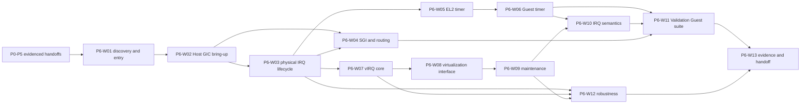

# Rust Type-1 Hypervisor — P6 Stage Task Book v0.2

**Stage ID:** P6
**Stage name:** Timer, GICv3, and Virtual Interrupt v0
**Status:** Current amended planning baseline; implementation and validation are not claimed
**Owner/change context:** P6 acceptance of deferred P1 NC6 execution under ADR-061, 2026-09-26
**Supersedes:** [P6 task book v0.1](task-book-v0.1.md)
**Governing documents:** [Architecture baseline ADR](../../adr/adr-000-architecture-baseline-v0.1.md), [ADR-061](../../adr/adr-061-defer-p1-asynchronous-vector-validation-to-p6.md), [documentation index](../../README.md), and [Plan Agent guide](../../development/plan-agent-guidelines.md)
**Upstream stages:** P0–P5
**Primary downstream stages:** P7 scheduler/preemption; P8 virtual platform and Linux bring-up

## 1. Purpose and boundary

P6 establishes the first bounded AArch64 asynchronous-event chain on QEMU virt:
physical time and interrupts are received at EL2, handled according to the Host
GICv3 lifecycle, represented as isolated vCPU events where required, and
ultimately become observable Guest-EL1 timer or virtual-IRQ handling. It also
establishes the evidence and behavior records that P7 and P8 must inspect
before relying on that chain.

The stage is about correctness, isolation, and observability. A timer marker or
one injected IRQ alone is insufficient. Planned validation must cover capability
discovery, per-pCPU initialization, SGI/SPI routing, Host and Guest timer
behavior, pending and List-Register pressure, maintenance processing, Guest
masking and priority behavior, multi-vCPU isolation, hostile inputs, telemetry,
regression, and factual handoff.

[ADR-061](../../adr/adr-061-defer-p1-asynchronous-vector-validation-to-p6.md)
also assigns P6 the first *executed* unexpected EL2 asynchronous-vector
test. P1 supplies a structural 16-slot vector and diagnostic contract, not
executed IRQ/FIQ/SError delivery evidence. P6-W12 closes this transferred
NC6 obligation only after Host GIC/IRQ readiness; P6-V29 is a required
stage gate, not optional regression or a retroactive P1 test pass.

### Required

- verify the P0–P5 entry contracts and the platform's GICv3/virtualization
  capability before using interrupt hardware;
- establish the Host GICv3 Distributor, per-pCPU Redistributor and system
  register CPU-interface lifecycle for SGI, PPI, SPI, acknowledgement,
  completion, and safe unknown/spurious handling;
- establish Host cross-pCPU SGI and basic SPI routing without making CPU0 or a
  QEMU-specific path a generic-Core assumption;
- establish per-pCPU EL2 monotonic-time and deadline-event behavior;
- establish vCPU-owned Guest generic-timer behavior across Guest entry/exit,
  including eventual delivery when an expiry occurs while the vCPU is absent;
- establish isolated virtual-interrupt lifecycle, deferred delivery, hardware
  presentation through the GICv3 virtualization interface, List-Register
  pressure handling, and maintenance processing;
- define and test the P6 Validation Guest interrupt scenarios, including the
  required two-vCPU cases only when an evidenced upstream multi-vCPU contract
  exists;
- constrain invalid Guest interrupt requests, unknown/spurious Host IRQs,
  impossible state, and storm smoke cases to diagnosable safe outcomes;
- execute the transferred P1 NC6 obligation with a genuine unexpected EL2
  asynchronous event after Host GIC/IRQ readiness, with bounded diagnostics
  and reproducible raw evidence; a synchronous proxy does not qualify;
- produce planned telemetry, QEMU integration/regression, implementation
  records, validation evidence, performance baseline, and P7/P8 handoff only
  after actual work has occurred.

### Reserved

- a P6 virtual-IRQ namespace, temporary Validation Guest interrupt layout,
  timer pause/resume behavior, and basic priority semantics may be selected in
  detailed design; none freezes the P8 rusthv-arm-virt-v1 machine ABI;
- the P3 host notification transport may be used by P6 hardware-facing work,
  while P6 must define any higher-level IRQ protocol it needs;
- P6 must leave room for vCPU migration, M:N scheduling, scheduler classes,
  CPU/vCPU hotplug, VM pause/resume, ITS/MSI/MSI-X, passthrough, SMMU,
  snapshot/migration, x86 interrupt backends, and nested virtualization;
- the detailed design selects register sequencing, locking, queue/coalescing,
  List-Register allocation, timer programming, trace encoding, and the exact
  supported GIC revision after authoritative specification/platform review.

### Out of scope

- a general preemptive scheduler, run queues, load balancing, CPU overcommit,
  scheduler policy, or timer-driven vCPU selection (P7);
- the Linux-ready vGIC Distributor/Redistributor MMIO model, Guest DTB, PSCI,
  Guest SMP, machine-specific IRQ layout, Linux boot, or frozen machine ABI
  (P8);
- GICv2, ITS, LPI, MSI/MSI-X, PCI interrupt virtualization, IOMMU interrupt
  remapping, direct/posted device IRQ optimization, Windows interrupt
  compatibility, nested virtualization, production IRQ-DoS policy, wall
  clock/RTC/NTP, advanced time scaling, snapshot/migration timer
  serialization, and full Orange Pi 3B bring-up;
- crate/module/API/data-layout/algorithm decisions or implementation evidence
  in this task book or its work-package plans.

P6 must not treat a platform name as an architecture decision, equate a
physical IRQ with a Guest IRQ, bind vCPU timer state to a pCPU, or use VM role
or identity as authorization. QEMU is the reference validation environment; it
does not define AArch64 or real-hardware semantics.

## 2. Source constraints and entry conditions

The ADR requires AArch64-first GICv3 (ADR-002, ADR-032), capability-driven
platform layering (ADR-041–ADR-045), Guest-untrusted boundaries (ADR-007),
separate physical CPU and vCPU identities (ADR-015–ADR-016), a vCPU-owned
virtual timer and virtual-interrupt object model, structured IRQ telemetry
(ADR-048), and layered validation (ADR-049). Core remains independent of
architecture, SoC, Board, and QEMU implementation details.

P6 implementation may begin only after an entry review finds the following
inputs and their actual evidence. The table is a dependency, not a claim that
any predecessor has completed.

| Entry condition(s) | Upstream | Required handoff to inspect | P6 use |
|---|---|---|---|
| P6-ENTRY-01, P6-ENTRY-02, P6-ENTRY-06 | P4 | Stage-2 isolation, Guest EL1 entry/exit/re-entry, Validation Guest, controlled exit/fault diagnostics | Guest timer/IRQ delivery without redefining Guest execution |
| P6-ENTRY-03, P6-ENTRY-04 | P3 | online pCPU lifecycle, CPU-local state, synchronization rules, cross-pCPU notification, TLB transport, SMP telemetry | independent local GIC/timer state and safe cross-pCPU coordination |
| P6-ENTRY-05 | P1 | stable Non-secure EL2 exception vectors and reviewed structural IRQ/FIQ/SError entry/diagnostic contract, CPU feature inventory, timer-access baseline; NC6 remains unexecuted under ADR-061 | EL2 exception receipt and architectural capability investigation; P6-W12 must supply the deferred dynamic proof |
| supporting entry baseline | P0 | toolchain/QEMU entry, testing, unsafe, diagnostics, trace, dependency and integration governance | reproducible review, evidence, and controlled low-level work |
| supporting platform input | P2 | validated PlatformInfo GIC/timer/CPU facts, MMIO ranges, capability states, reservation and ownership constraints | safe discovery and platform-capability input |
| P6-ENTRY-07 | P5 | versioned HVC/error behavior, handle/capability checks, guest-safe access and regression boundary | authorized test/control paths and Guest-error isolation |

Missing, contradictory, or unverified input blocks the affected detailed
design. It must be recorded as Architecture Change Request, ADR Required,
Platform Investigation, or Specification Investigation; P6 must not repair or
silently redesign the predecessor.

## 3. Delivery hierarchy and package map

Read a P6 package in this order: ADR, this task book, the
[plan index](plans/README.md), the selected plan, the Coding Guide plus an
approved detailed design before code changes, then the implementation and
verification records. Plans are bounded work packages; they do not define
modules, APIs, structures, register sequences, algorithms, or results.

| Package | Required outcome | Primary validation |
|---|---|---|
| P6-W01 | Platform GICv3, Redistributor, CPU-interface, virtualization-interface, and range capabilities are reconciled with P2 facts and rejected when unusable. | P6-V01 |
| P6-W02 | Host Distributor, per-pCPU Redistributor, and CPU-interface initialization establish independent local GIC readiness. | P6-V02, P6-V03 |
| P6-W03 | The physical IRQ lifecycle safely classifies, dispatches, completes, and diagnoses SGI/PPI/SPI and spurious/unknown inputs. | P6-V20, P6-V22 |
| P6-W04 | Cross-pCPU SGI and basic SPI routing operate with explicit targets and no scheduler-policy claim. | P6-V04–P6-V06 |
| P6-W05 | EL2 has per-pCPU monotonic-time and deadline-event behavior that P7 may later consume. | P6-V07, P6-V08 |
| P6-W06 | vCPU-owned Guest generic timers survive entry/exit and eventually present expiration events without cross-vCPU contamination. | P6-V09, P6-V10, P6-V19 |
| P6-W07 | A generic, isolated vIRQ lifecycle preserves deferred and repeated events for a specified vCPU. | P6-V11, P6-V12, P6-V14, P6-V18 |
| P6-W08 | GICv3 virtualization-interface presentation connects pending vIRQs to available List Registers and preserves state across vCPU execution. | P6-V11, P6-V16, P6-V18 |
| P6-W09 | Maintenance events release completed presentation state and allow later pending vIRQs to progress. | P6-V16, P6-V17 |
| P6-W10 | Basic masking, priority, timer-plus-vIRQ, and pending semantics are defined and exercised. | P6-V13–P6-V15 |
| P6-W11 | The maintained Validation Guest provides the declared timer, vIRQ, exception-vector, multi-vCPU-conditional, and Host-SGI scenarios. | P6-V09–P6-V19 |
| P6-W12 | Invalid requests, spurious/unknown IRQs, impossible state, storm smoke and transferred P1 NC6 unexpected-vector execution are isolated and diagnosable. | P6-V20–P6-V22, P6-V29 |
| P6-W13 | Telemetry, latency baseline, P0–P5 regression, factual documentation, evidence, and P7/P8 handoff are collected. | P6-V23, P6-V24–P6-V28 |

Every package has exactly one plan in [plans/](plans/README.md). Completion
evidence belongs in verification; detailed designs and implementation
traceability belong in implementation.

## 4. Dependency and execution map

W05 and W07 may proceed after W03 when their detailed designs agree on the
Host IRQ lifecycle and shared-state constraints. W06 and W08 may proceed in
parallel after their respective prerequisites, but W10 and W11 must consume
their compatible results. The directed graph is acyclic.

## 5. Requirement-to-validation traceability

| Requirement group | Planned package | Validation |
|---|---|---|
| P6-A: capability discovery and unusable-platform rejection | W01 | P6-V01 |
| P6-B: Distributor, Redistributor, CPU-interface, local initialization | W02 | P6-V02, P6-V03 |
| P6-C: physical IRQ lifecycle, classification, completion, unknown/spurious behavior | W03 | P6-V20, P6-V22 |
| P6-D: Host SGI and SPI routing | W04 | P6-V04–P6-V06 |
| P6-E: Host monotonic time and per-pCPU deadline timer | W05 | P6-V07, P6-V08 |
| P6-F: Guest timer state, exits, deferred expiry, optional pause/resume record | W06 | P6-V09, P6-V10, P6-V19 |
| P6-G: generic vIRQ state, pending/deferred/repeated delivery, vCPU isolation | W07 | P6-V11, P6-V12, P6-V14, P6-V18 |
| P6-H: virtualization interface, List Registers, state save/restore, pressure | W08 | P6-V11, P6-V16, P6-V18 |
| P6-I: maintenance completion and further presentation | W09 | P6-V16, P6-V17 |
| P6-J: masking, priority, pending, and concurrent timer/vIRQ semantics | W10 | P6-V13–P6-V15 |
| P6-K: Validation Guest interrupt scenarios and conditional multi-vCPU exercise | W11 | P6-V09–P6-V19 |
| P6-L: isolation, invalid request, spurious, impossible-state, storm behavior and transferred NC6 | W12 | P6-V20–P6-V22, P6-V29 |
| P6-M: telemetry, latency baseline, regression, documentation, and downstream contract | W13 | P6-V23–P6-V28 |

## 6. Stage validation matrix

All rows define planned evidence and objective success conditions. They do not
claim that an implementation exists or a command has run.

| ID | Evidence sought | Success condition |
|---|---|---|
| P6-V01 | GIC capability and P2-platform-fact review | required GIC version, virtualization support, CPU interfaces, Redistributor coverage, IRQ/MMIO facts, and rejection paths are explicit and compatible. |
| P6-V02 | BSP Host-GIC initialization evidence | Distributor and BSP-local interfaces reach the declared safe usable state with residual state handled diagnostically. |
| P6-V03 | AP-local GIC initialization evidence | every evidenced online pCPU independently initializes its Redistributor and CPU interface; BSP-local state is not reused. |
| P6-V04 | CPU0-to-CPU1 Host SGI evidence | target receipt and completion are attributable to the intended online pCPU. |
| P6-V05 | CPU1-to-CPU0 and multi-target SGI evidence | reverse and declared multi-target delivery have determinate target accounting. |
| P6-V06 | SPI routing-change evidence | a supported SPI reaches its recorded target and a changed route reaches the replacement target. |
| P6-V07 | EL2 one-shot timer evidence | a future deadline yields one attributable Host timer IRQ and controlled rearm/cancel result. |
| P6-V08 | EL2 repeated-timer and monotonicity evidence | repeated per-pCPU events remain stable in the declared environment and entry/exit does not regress observed monotonic time. |
| P6-V09 | Guest virtual-timer scenario evidence | the Guest reads/programs/enables a timer and observes a handled virtual-timer event. |
| P6-V10 | Timer across HVC and controlled exit evidence | declared Guest exits preserve timer behavior without loss or Host-state contamination. |
| P6-V11 | Single-vIRQ presentation evidence | an authorized event for a specified vCPU is eventually presented, acknowledged, and completed. |
| P6-V12 | Multiple-pending-vIRQ evidence | distinct pending events survive deferred presentation and all reach a determinate completion outcome. |
| P6-V13 | Guest mask/pending/unmask evidence | an IRQ remains pending while masked and becomes observable after unmask without false completion. |
| P6-V14 | Repeated-same-vIRQ evidence | repeat arrival in pending or active state follows the documented policy without state corruption. |
| P6-V15 | Timer-plus-vIRQ and basic-priority evidence | both event classes progress and the documented priority relation is preserved. |
| P6-V16 | List-Register pressure evidence | more pending vIRQs than presentable slots produces no loss or overwrite and leaves excess work pending. |
| P6-V17 | Maintenance-event evidence | completion/reusable-slot handling advances the remaining queue with no duplicate completion or active-state leak. |
| P6-V18 | multi-vCPU vIRQ isolation evidence | an event directed to one vCPU is not received by another; unavailable multi-vCPU prerequisites are recorded as a stage block. |
| P6-V19 | multi-vCPU timer isolation evidence | each exercised vCPU has independent timer state; unavailable multi-vCPU prerequisites are recorded as a stage block. |
| P6-V20 | spurious/unknown physical-IRQ evidence | no invalid handler/index or Guest injection occurs; outcome is safely diagnosed. |
| P6-V21 | invalid vIRQ authorization/input evidence | invalid range, priority, target, dead object, wrong owner, or insufficient right is rejected without Host/other-VM effect. |
| P6-V22 | high-rate IRQ/timer/SGI smoke evidence | declared stress limits yield no observed state corruption or unexplained loss/hang; this does not prove production DoS resistance. |
| P6-V23 | P0–P5 regression evidence | the documented upstream regression set remains determinate after P6 changes. |
| P6-V24 | structured IRQ/timer telemetry review | Host IRQ class/per-pCPU counts, timer, vIRQ lifecycle, and maintenance data are correlated and available. |
| P6-V25 | latency-baseline evidence | physical/virtual event-to-Guest-handler measurement is recorded with environment and method, without an unearned KPI claim. |
| P6-V26 | QEMU virt integration and repeat evidence | positive, negative, recovery, and repeat scenarios give determinate outcomes in the declared QEMU environment. |
| P6-V27 | P6 documentation review | implemented facts, semantics, known limitations, validation matrix, and performance baseline are located in the prescribed layers. |
| P6-V28 | P7/P8 consumer review | downstream planners can identify proven P6 behavior, exclusions, evidence, and unresolved issues without inferring a scheduler or machine ABI. |
| P6-V29 | Deferred P1 NC6 unexpected EL2 vector evidence | after P6-W02/W03 Host GIC/physical-IRQ readiness, a genuine validation-only asynchronous IRQ/FIQ/SError reaches an EL2 vector in a declared non-expected context on at least two runs; origin/category, phase and relevant frame are diagnosed, the declared terminal/containment route is bounded, and complete raw captures agree. A synchronous trap, direct vector branch or fabricated marker is not evidence. If the declared QEMU environment cannot produce the event, this gate remains blocked pending an approved alternate environment or later architecture decision. |

## 7. Documentation, exit criteria, and handoff

After real implementation and validation, P6 must record the following future
artifacts. They are not present completion claims.

| Deliverable | Required factual content |
|---|---|
| P6-DOC-01 — GICv3 Bring-up Record | used GIC version, QEMU configuration, Distributor/Redistributor discovery, CPU-interface and virtualization capability facts |
| P6-DOC-02 — Interrupt Semantics v0 | implemented Host IRQ/vIRQ lifecycle, pending/active/completed meanings, masking, priority, and maintenance behavior |
| P6-DOC-03 — Generic Timer Semantics v0 | Host monotonic/per-pCPU timer, vCPU Guest timer, and implemented pause/exit/re-entry behavior |
| P6-DOC-04 — Validation Matrix | P6-V01–P6-V29 evidence with environment, result, and limitation records, including transferred NC6 provenance |
| P6-DOC-05 — P6 Performance Baseline | timer/vIRQ latency, IRQ throughput smoke, maintenance frequency, and Guest IRQ-path exit data |

P6 may close only with real evidence for P6-V01 through P6-V29 and all of the
following:

1. Host GIC initialization is stable on QEMU virt, with independent local
   readiness on every declared online pCPU and evidenced SGI plus supported
   PPI/SPI routing.
2. Per-pCPU EL2 timer events and monotonic-time behavior are evidenced.
3. Guest virtual timers and authorized vIRQs complete their documented paths
   across Guest exits, masking, deferred delivery, List-Register pressure, and
   maintenance processing without loss or cross-vCPU delivery.
4. Invalid Guest requests, unknown/spurious IRQs, and declared storm cases do
   not compromise Host or other-VM state; transferred NC6 has a genuine,
   repeated EL2 asynchronous-vector diagnostic and bounded outcome.
5. Required telemetry, latency baseline, upstream regression, QEMU evidence,
   factual documents, unsafe-inventory delta, and limitations are recorded.

P7 may consume only evidenced P6 Host timer, IRQ lifecycle, SGI, vCPU timer,
vIRQ, and interrupt-state save/restore behavior as mechanisms for its own
preemption and scheduling design; P7 owns runnable-state, switch, wakeup, and
policy semantics. P8 may consume evidenced lower-level GIC virtualization and
timer behavior; it owns the Linux-visible vGIC MMIO/DTB/PSCI/machine-ABI and
Guest-SMP contracts. Neither stage may infer that P6 froze an API, a
machine-specific IRQ layout, a vCPU affinity policy, or QEMU behavior as a
hardware contract.

## 8. Open planning classifications

| Topic | Classification | Required handling |
|---|---|---|
| exact supported GIC revision, feature availability, and platform register/range interpretation | Platform and Specification Investigation | reconcile validated PlatformInfo with the applicable authoritative architecture/GIC specification before detailed design. |
| Host IRQ/vIRQ state representation, locking, coalescing, List-Register allocation, timer programming, and trace encoding | Implementation Choice | resolve in approved detailed design under ADR, ownership, concurrency, and telemetry constraints. |
| documented Guest timer behavior when an evidenced pause/resume facility already exists | Implementation Choice | choose and validate one bounded behavior; do not introduce scheduler policy. |
| missing P0–P5 contract, contradictory IRQ/timer routing rule, or frozen ABI/machine-model conflict | Architecture Change Request / ADR Required | stop the affected decision, record the conflict, and obtain governing resolution. |
