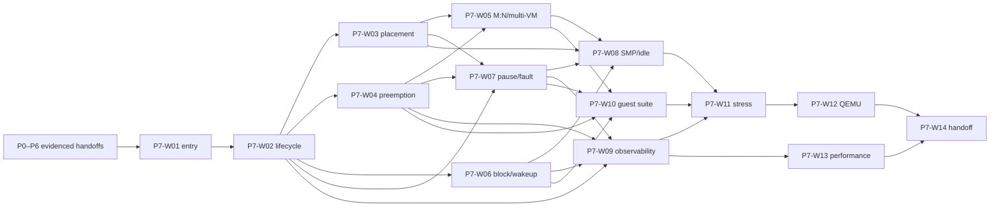

# P7 — vCPU Scheduler v0 to Preemptive M:N Scheduling

**Stage ID:** P7
**Status:** Implementation-planning baseline; work and evidence are not claimed
**Scope:** AArch64-first scheduler-controlled vCPU execution on QEMU `virt`
**Owner/change context:** P7 planning set reconstructed from the root-level P7 Stage Task Book v0.1 input
**Supersedes:** the relocated root-level `Rust Type-1 Hypervisor — P7 Stage Task Book v0.1.md` input
**Governing documents:** [Architecture baseline ADR](../../adr/adr-000-architecture-baseline-v0.1.md), [documentation index](../../README.md), and [Plan Agent guide](../../development/plan-agent-guidelines.md)
**Upstream:** P0–P6
**Primary downstream stage:** P8 — Generic ARM64 virtual machine and minimum SMP Linux boot

## 1. Purpose and constraints

P7 makes normal Guest entry scheduler-controlled. It establishes a first correct preemptive shared-CPU scheduler: a pCPU selects a runnable vCPU or idles; a CPU-bound Guest can be preempted; a blocked Guest releases its pCPU; and more vCPUs than pCPUs make progress without violating lifecycle, affinity, pinning, pause, or isolation rules. VM is a lifecycle container; vCPU is the sole schedulable Guest execution entity.

ADR-002 keeps the first implementation AArch64-first, while ADR-004/005 require a modular policy-independent Core. ADR-006 constrains low-level Rust and `unsafe`; ADR-007 treats Guest workloads and event timing as untrusted; ADR-013 preserves capability-based authority; ADR-015 requires SMP; ADR-016 requires evolution from static binding to preemptive M:N while preserving pinned/dedicated operation; ADR-017 reserves RT scheduling; ADR-018 preserves address-space correctness; ADR-032 retains GICv3; ADR-041–045 prohibit board-name policy in Core; ADR-048–049 require structured telemetry and layered validation. ADR-057 leaves the shared-scheduler algorithm undecided.

Architecture-independent lifecycle, placement, pause, accounting, and observability semantics must not depend on AArch64 registers or GIC List Registers. An approved detailed design chooses implementation mechanics. QEMU is a reference test environment, never the architecture definition.

## 2. Entry conditions and scope

### Required predecessor contracts

This table records implementation dependencies only; it does not claim P0–P6 completion.

| Upstream | Required P7 input | P7 boundary |
|---|---|---|
| P0 | build/test/QEMU entry, CI, unsafe/dependency governance, diagnostics and trace namespace | repeatable execution/evidence; implementation records any new unsafe |
| P1 | stable AArch64 Non-secure EL2 runtime and exception/fatal-diagnostic boundary | regain EL2 control without redefining bring-up |
| P2 | normalized platform CPU/memory facts, allocatable-memory and capability inputs | eligible host resources without platform-name branches |
| P3 | online pCPU identities, per-CPU state, synchronization rules, cross-CPU notification, TLB transport | pCPU scheduling and remote reschedule/pause; no SMP redesign |
| P4 | independent VM/vCPU, context save/restore, Stage-2 identity and exit/fault boundary | context switching and containment; no Stage-2 redesign |
| P5 | handle/capability and Guest-failure classification boundary | explicit invalid-control handling; no management ABI or authority-policy design |
| P6 | per-pCPU EL2 deadline timer, vCPU timer, pending vIRQ/event delivery, GIC maintenance behavior, timer/IRQ telemetry | preemption and wakeup; no timer/vIRQ/GIC/LR redesign |

Absent, contradictory, or unevidenced input blocks the affected package. Record a blocked prerequisite, Architecture Change Request, or ADR Required issue; do not repair upstream scope in P7.

### Required

- Scheduler-controlled normal Guest entry and return after exit, with only bounded early-boot/bring-up/emergency-debug exceptions.
- Explicit `Offline`, `Runnable`, `Running`, `Blocked`, `Paused`, `Stopped`, and `Faulted` semantics, legal transitions, rejected invalid transitions, and one-vCPU/one-pCPU invariants.
- Static pinned equivalence, affinity, pinning, dedicated/shared semantics, explicit invalid configuration errors, and no silent fallback.
- Timer preemption, testable time-slice semantics, context preservation, M:N overcommit, multi-VM progress, and basic no-starvation fairness.
- Scheduler-visible WFI/WFE blocking, timer/vIRQ/Notification/internal-event wakeup, pause/resume, stop/fault containment, SMP placement, remote rescheduling, and idle behavior.
- vCPU/pCPU/VM accounting, structured trace and failure diagnostics, Validation Guest workloads, automated QEMU regression, stress/property evidence, performance baseline, and factual closeout/P8 handoff records.

### Reserved

Weighted/proportional fairness, shares/quotas, dynamic policy switching, advanced balancing, NUMA, RT/partition scheduling, CPU hotplug, dynamic VM/vCPU creation, migration/snapshot policy, full Control Domain configuration, and real RK3566 scheduling evidence remain later work. P8 owns Generic ARM64 machine/guest-CPU presentation, virtual PSCI/SGI, Linux boot, DTB/ACPI, and Linux-ready vGIC.

### Out of scope

P7 does not select a final scheduler algorithm, queue topology, work stealing, lock or lock-free method, memory order, timer representation/programming, time-slice value, tick model, migration policy, context-save layout, assembly boundary, public API, trace encoding, crate/module layout, or affinity-mask representation. These need detailed design. P7 makes no real-hardware, performance-KPI, implementation, or completion claim.

## 3. Work-package map

Read ADR → this task book → [plan index](plans/README.md) → selected plan → Coding Guide plus approved detailed design before code → implementation/verification record. Each package has exactly one plan.

| Package | Required outcome | Source task groups | Primary validation |
|---|---|---|---|
| P7-W01 | Reconciled P0–P6 contracts, authority, scope and evidence inputs. | entry; P7-T01 | P7-V01 |
| P7-W02 | Scheduler admission, lifecycle, legal transitions, core invariants. | P7-T01, P7-T03–P7-T04, P7-T30 | P7-V02–V04 |
| P7-W03 | Pinned, affinity, dedicated/shared configuration and invalid controls. | P7-T02, P7-T11–P7-T13, P7-T27–P7-T28 | P7-V05–V07 |
| P7-W04 | Timer preemption, time-slice semantics, context-switch preservation. | P7-T05–P7-T07 | P7-V08–V09 |
| P7-W05 | M:N, multi-VM scheduling and basic fairness. | P7-T08–P7-T10 | P7-V10–V12 |
| P7-W06 | WFI blocking and event wakeup race safety. | P7-T14–P7-T15 | P7-V13–V14 |
| P7-W07 | Pause/resume, stop/fault containment and remote-running-vCPU handling. | P7-T16–P7-T18, P7-T29 | P7-V15–V16 |
| P7-W08 | SMP placement, cross-CPU reschedule and idle behavior. | P7-T19–P7-T21 | P7-V17–V18 |
| P7-W09 | Accounting, trace, switch reasons and deterministic diagnostics. | P7-T22–P7-T26, P7-T43 | P7-V19–V21 |
| P7-W10 | Validation Guest scheduler suite and single-/multi-vCPU regression. | P7-T31–P7-T32, P7-T41 | P7-V22–V23 |
| P7-W11 | Multi-VM/overcommit/race/fairness/placement stress evidence. | P7-T33–P7-T38 | P7-V24–V27 |
| P7-W12 | Automated declared QEMU scheduler matrix. | P7-T42 | P7-V28 |
| P7-W13 | Performance and static-versus-scheduled baseline. | P7-T39–P7-T40 | P7-V29 |
| P7-W14 | Behavior documentation, closure review and P8 handoff. | P7-T44, deliverables, exits | P7-V30 |

Plans are bounded work, not implementation design or completion evidence.

## 4. Dependency and execution map

W03 and W04 may proceed in parallel after W02 only if their detailed designs preserve the same lifecycle authority. The graph is acyclic and no planned predecessor is completion evidence.

## 5. Requirement-to-validation traceability

| Requirement group | Package | Validation |
|---|---|---|
| P0–P6 contract/scope and scheduler-controlled entry | W01, W02 | P7-V01, V02 |
| lifecycle, transitions, one-vCPU/one-pCPU and non-runnable exclusion | W02 | P7-V03, V04 |
| static pinned, affinity, pinning, dedicated/shared and invalid controls | W03 | P7-V05–V07 |
| preemption, time slice, context/address-space/timer/vIRQ/event isolation | W04 | P7-V08, V09 |
| 1:2, 2:4, 4:8 M:N; two VM progress; basic fairness | W05 | P7-V10–V12 |
| WFI/WFE and timer/vIRQ/Notification/internal-event wakeup | W06 | P7-V13, V14 |
| pause/resume, pending event, stopped/faulted exclusion and containment | W07 | P7-V15, V16 |
| SMP, cross-CPU and idle-to-work behavior | W08 | P7-V17, V18 |
| counters, aggregation, trace, reason and diagnostics | W09 | P7-V19–V21 |
| Validation Guest CPU/WFI/timer/IRQ/SGI/shared-memory/HVC workloads | W10 | P7-V22, V23 |
| race/invariant, multi-VM, overcommit, fairness and placement stress | W11 | P7-V24–V27 |
| automated QEMU matrix | W12 | P7-V28 |
| performance comparison baseline | W13 | P7-V29 |
| documents, evidence index, limits and P8 handoff | W14 | P7-V30 |

## 6. Validation matrix

All rows are planned evidence and objective conditions, not claims that tests ran.

| ID | Evidence sought | Passing condition and limit |
|---|---|---|
| P7-V01 | handoff/scope review | every needed input is linked and compatible, or missing/conflicting input is recorded as blocked |
| P7-V02 | admission review/test | normal entry/exit returns through scheduler control; only bounded non-normal paths bypass it |
| P7-V03 | transition test | stated lifecycle transitions are valid and invalid transitions are rejected |
| P7-V04 | invariant/property evidence | no vCPU double-runs; a running vCPU has one pCPU; non-runnable states do not enter Guest; accounting does not regress/double-count |
| P7-V05 | pinned regression | pinned workload stays on its pCPU and retains declared static baseline behavior |
| P7-V06 | placement matrix | affinity, pinning and mixed dedicated/shared cases never use ineligible pCPU |
| P7-V07 | invalid-control tests | empty/nonexistent/offline/conflicting/destroyed/invalid controls fail explicitly |
| P7-V08 | CPU-bound preemption | deadline returns a non-exiting/non-blocking Guest to EL2; it cannot monopolize shared pCPU |
| P7-V09 | switch isolation | A→B→C→A preserves registers, PC/PSTATE, required system state, address space, timer, vIRQ and events |
| P7-V10 | M:N matrix | 1/2, 2/4 and 4/8 make progress without duplicate or non-runnable execution |
| P7-V11 | multi-VM workload | two VMs preserve opportunities under CPU/HVC/WFI-heavy work |
| P7-V12 | fairness | equal-class continuously runnable vCPUs receive sustained nonzero execution; no proportional-fairness claim |
| P7-V13 | block evidence | no-event WFI/WFE releases pCPU; preexisting event does not strand vCPU |
| P7-V14 | wakeup races | timer/vIRQ/Notification/internal events produce eligible runnable vCPU without lost wakeup, duplicate running or invalid wakeup |
| P7-V15 | pause/resume matrix | running/runnable/blocked pause safely; VM pause leaves no Guest executing; resume preserves eligibility/placement/events |
| P7-V16 | containment | stopped/faulted excluded; Guest-specific fault does not corrupt other VM scheduling |
| P7-V17 | SMP evidence | pCPUs concurrently run distinct vCPUs and isolate scheduler state |
| P7-V18 | remote/idle evidence | remote work/pause causes appropriate reschedule; idle avoids busy loop and resumes on work |
| P7-V19 | accounting | vCPU/pCPU/VM counters are observable and coherent across scheduler events |
| P7-V20 | trace/reason | events associate VM/vCPU/pCPU/reason/time; stop-running reason is distinguishable |
| P7-V21 | diagnostics | failure reports current pCPU, VM/vCPU/state/affinity/reason/recent and pending events; no crash-dump claim |
| P7-V22 | single-vCPU regression | 1VM/1vCPU/1pCPU Validation Guest remains stable |
| P7-V23 | guest suite | declared multi-vCPU counter, SGI/IRQ, timer, WFI/wakeup and HVC workloads exercise P7 |
| P7-V24 | M:N stress | 4pCPU/8vCPU/two-VM and 2× overcommit show no corruption/starvation/livelock; 4× reported separately |
| P7-V25 | race stress | before/during/after-block events and pause/resume lose no wakeup/timer/vIRQ or placement guarantee |
| P7-V26 | invariant/fairness stress | checks/assertions cover P7 invariants and no long-lived runnable vCPU starves |
| P7-V27 | placement stress | overlapping, same-CPU and dedicated/shared mixtures obey configuration |
| P7-V28 | automated QEMU | 1/1, 1/2, 2/4, 4/4, 4/8 plus pause/wakeup/affinity/pinning give determinate results |
| P7-V29 | baseline record | declared latency/switch metrics and static comparison record environment/limits; no KPI |
| P7-V30 | closure/handoff review | behavior docs, evidence index, limits, unsafe delta, dependency status and P8 input are present |

## 7. Exit criteria and P8 handoff

P7 closes only with evidence for P7-V01 through P7-V30 and: CPU-bound Guests cannot monopolize shared CPU; 4pCPU/8vCPU/two-VM M:N operation is stable without permanent starvation; blocked vCPUs release CPU and eligible wakeups work; no vCPU double-runs; affinity/pinning/pause/stop/fault/SMP semantics hold; Validation Guest, stress and QEMU evidence exist; telemetry/diagnostics and performance baselines are reviewable; and no board-specific Core contract is added.

P8 may rely only on evidenced P7 semantics: scheduler-controlled entry, lifecycle/placement/blocking/pause behavior, preemption/context isolation, SMP M:N progress, scheduler Validation Guest coverage, and scheduler observability/regression entry points. P8 still owns machine ABI, guest SMP presentation and Linux boot.

## 8. Open planning classifications

| Topic | Classification | Handling |
|---|---|---|
| algorithm, queues, migration, time slice/tick model | Implementation Choice | approved detailed design must meet ADR-016 and P7 validation; ADR-057 remains visible |
| synchronization, ordering, authority, remote notification and timer/vIRQ races | Implementation Choice | use P3/P6 contracts and record ownership/failure semantics in detailed design |
| scheduler-control authorization and dynamic configuration | Specification Investigation | preserve P5 capabilities; do not invent Control Domain policy |
| QEMU vs AArch64 semantics; later RK3566 timing | Platform Investigation | cite architecture/platform evidence; never promote QEMU behavior to Core contract |
| predecessor conflict | Architecture Change Request / ADR Required | stop the affected decision and record it |
