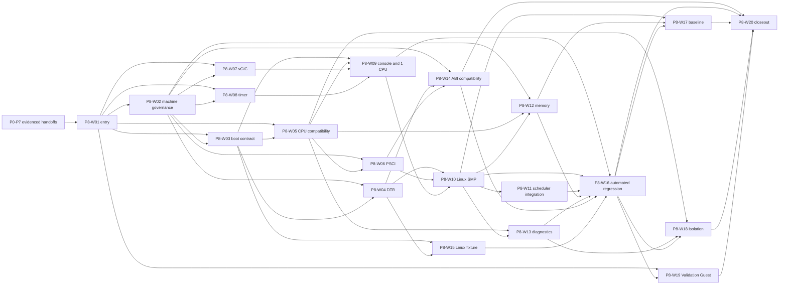

# P8 — Virtual ARM Platform and Minimal Linux Boot

**Stage ID:** P8
**Status:** Implementation-planning baseline; work, ABI freezing, and evidence are not claimed
**Scope:** AArch64-first, host-independent versioned Guest machine and minimum custom Linux boot on QEMU `virt`
**Owner/change context:** P8 planning set reconstructed from the root-level P8 Stage Task Book v0.1 input
**Supersedes:** the relocated root-level `Rust Type-1 Hypervisor — P8 Stage Task Book v0.1.md` input
**Governing documents:** [Architecture baseline ADR](../../adr/adr-000-architecture-baseline-v0.1.md), [documentation index](../../README.md), and [Plan Agent guide](../../development/plan-agent-guidelines.md)
**Upstream:** P0–P7
**Primary downstream:** P9 Virtio Core and later versioned-machine consumers

## 1. Purpose and authority

P8 plans the first complete, Guest-visible Generic ARM64 machine, named
`rusthv-arm-virt-v1`, and the integration path from its boot inputs to a custom
AArch64 Linux Guest reaching interactive initramfs userspace. Its required
outcome combines established EL2, Stage-2, VM/vCPU, scheduler, interrupt,
timer, and hypercall foundations without redesigning them.

The eventual machine contract must make Guest-visible CPU presentation, memory
and MMIO map, interrupt and timer behavior, firmware interface, DTB, console,
and compatibility rules independent of the QEMU host and any RK3566/board
facts. QEMU `virt` is a reference test environment; it does not define the
machine ABI or AArch64 semantics.

Authority is ADR → this task book → any approved frozen ABI/machine contract
→ established module contract → detailed design. ADR-024, ADR-025, ADR-040,
and ADR section 18 leave the concrete `rusthv-arm-virt-v1` IPA map, virtio slot
count, and GIC/PCI windows undecided. W02 must route these through the required
ADR/contract review. No plan selects numerical addresses, register encodings,
CPU features, device register model, PSCI subset, or other Guest ABI detail.
If an upstream input or required decision conflicts, record an
`Architecture Change Request` or `ADR Required` and stop that choice.

## 2. Entry conditions and stage boundary

The following are dependency records, not claims that P0–P7 have completed.
Implementation may use a predecessor only when its factual handoff and evidence
support the need.

| Upstream | Required P8 input to inspect | P8 boundary |
|---|---|---|
| P0 | repeatable build/test/QEMU route, unsafe/dependency governance, diagnostics, trace and documentation rules | reproducible fixtures and evidence; no toolchain redesign |
| P1 | stable AArch64 Non-secure EL2 entry, exception capture, Host-MMU and early diagnostic boundary | Guest exits and failures return to existing EL2 control |
| P2 | PlatformInfo, protected/reserved memory, allocation/ownership and host-device facts | bounded Guest backing and no host-fact leakage; no platform discovery redesign |
| P3 | pCPU identities, SMP synchronization, notification and TLB transport | Host-SMP substrate only; no pCPU or TLB redesign |
| P4 | Guest EL1 entry/exit, Stage-2 address space, bounded Guest memory and Validation Guest facts | Linux compatibility gap closure; no Stage-2 or VM foundation redesign |
| P5 | checked Guest input, capability/handle, controlled Guest-failure and diagnostic boundary | no management ABI, role shortcut, or authority policy design |
| P6 | timer, GICv3, vIRQ, maintenance, SGI and interrupt telemetry facts | Linux-facing compatibility validation; no foundational GIC/timer/LR redesign |
| P7 | scheduler-controlled execution, lifecycle, preemption, blocking/wakeup, placement, SMP and accounting facts | prove Linux integration; no scheduler algorithm or policy redesign |

### Required

- Reconcile the entry contracts, evidence status, security/layering constraints,
  and blocked dependencies before detailed design.
- Establish a formally reviewed, versioned machine-contract process for
  `rusthv-arm-virt-v1`: CPU, Guest physical-address categories, interrupts,
  timer, firmware/DTB, console, permanent ABI, reserved space, and compatible
  versus incompatible change rules. Concrete values require the stated routing.
- Establish a Linux Image + DTB + optional initramfs + bootargs boot contract,
  repeatable fixture basis, Guest-only DTB, Linux-compatible CPU behavior,
  PSCI lifecycle, GICv3, architected timer, and a non-Virtio console.
- Reach planned proof targets for one-, two-, and four-vCPU Linux: Linux
  userspace shell, SMP secondary start, scheduler/time/interrupt/memory
  behavior, clean shutdown, diagnostics, and bounded Guest faults.
- Provide planned machine-compatibility, automated QEMU, repeated-boot,
  security/isolation, Validation Guest, telemetry, performance-baseline, and
  documentation/closeout evidence routes.

### Reserved

Future virtio-MMIO and PCI address capacity, later machine versions, ACPI/UEFI,
additional CPU features, advanced GIC features, and later migration/snapshot
compatibility may be reserved by an approved machine contract. Reservation
cannot define the unimplemented protocol, window values, data format, runtime
policy, or implementation mechanism.

### Out of scope

Virtio framework/console/block/net/PCI transport, PCIe Guest bus, Control or
Service Domain, dynamic second-VM management, general configuration parsing,
filesystem/qcow2 loading, device assignment, SMMU/IOMMU isolation, snapshot,
migration, balloon/overcommit, ACPI, UEFI, Windows, nested virtualization,
ITS/LPI/MSI, and Orange Pi 3B bring-up are later work. P8 does not define
crate/module/API trees, data structures, register layouts, address values,
scheduler policy, PSCI calling convention, Linux version/configuration, or a
new security model.

## 3. Work-package map

Read ADR → this task book → [plan index](plans/README.md) → selected plan →
Coding Guide and approved detailed design before code → implementation and
verification record. Each package has exactly one plan.

| Package | Required outcome and source coverage | Primary validation |
|---|---|---|
| P8-W01 | Reconciled P0–P7 evidence, authority, scope, security, ABI/machine-model routing. | P8-V01 |
| P8-W02 | Machine-contract governance and freeze gate for P8.1, including unresolved-detail escalation. | P8-V02–V03 |
| P8-W03 | Linux boot input/lifecycle contract and reproducibility boundary for P8.2. | P8-V04 |
| P8-W04 | Guest-only DTB contract and machine-consistency review for P8.3. | P8-V05–V06 |
| P8-W05 | Linux CPU/system-register compatibility classifications and controlled rejection for P8.4. | P8-V07–V08 |
| P8-W06 | Standard PSCI lifecycle contract and secondary-start boundary for P8.5. | P8-V09 |
| P8-W07 | Linux-required virtual GICv3 behavior and stress scope for P8.6. | P8-V10 |
| P8-W08 | Linux time, virtual timer, SMP consistency and wakeup integration for P8.7. | P8-V11 |
| P8-W09 | Non-Virtio console and single-vCPU Linux path through interactive userspace for P8.8–P8.9. | P8-V12–V13 |
| P8-W10 | Two-/four-vCPU Linux SMP path and stability scenarios for P8.10. | P8-V14–V15 |
| P8-W11 | P7 scheduler/Linux 1:1 and M:N integration validation for P8.11. | P8-V16 |
| P8-W12 | Linux memory-model and Guest RAM-size validation boundary for P8.12. | P8-V17 |
| P8-W13 | Guest-fault classification and diagnosability for P8.13. | P8-V18 |
| P8-W14 | Machine ABI compatibility-test policy for P8.14. | P8-V19 |
| P8-W15 | Version-pinned or reproducibly generated Linux test asset for P8.15. | P8-V20 |
| P8-W16 | Automated QEMU Linux boot/repeat matrix for P8.16. | P8-V21–V22 |
| P8-W17 | Linux telemetry and non-KPI performance baseline for P8.17. | P8-V23 |
| P8-W18 | Guest-untrusted security and isolation regression for P8.18. | P8-V24 |
| P8-W19 | Validation Guest retention and dual-track regression for P8.19. | P8-V25 |
| P8-W20 | Factual-documentation route, closeout review and P9 handoff for P8.20. | P8-V26 |

Plans are bounded work, not detailed design, source changes, verification
evidence, or completion claims.

## 4. Dependency and execution map

The graph is acyclic. W04/W05/W07/W08 may be planned in parallel after their
listed inputs, provided their detailed designs preserve one reviewed machine
contract and do not turn a pending ABI decision into an implementation fact.

## 5. Requirement-to-validation traceability

| Requirement group | Package | Validation |
|---|---|---|
| P0–P7 handoff, scope, authority, security and unresolved-decision review | W01 | P8-V01 |
| machine identity, ABI categories, reservation/change governance | W02 | P8-V02, V03 |
| Image/DTB/initramfs/bootargs, boot state and shutdown contract | W03 | P8-V04 |
| Guest CPU/memory/chosen/PSCI/timer/GIC/console DTB without host leakage | W04 | P8-V05, V06 |
| EL1/system-register/MMU/TLB/cache/barrier/WFI/WFE/features classification and diagnostics | W05 | P8-V07, V08 |
| standard PSCI version/features, CPU lifecycle and system-off route | W06 | P8-V09 |
| Linux vGIC initialization, IRQ state, SGI, timer/SPI behavior | W07 | P8-V10 |
| counter, timer IRQ, monotonicity, preemption and WFI wakeup | W08 | P8-V11 |
| serial console and one-vCPU Linux to interactive initramfs shell | W09 | P8-V12, V13 |
| 2/4-vCPU enumeration, PSCI secondary start, per-CPU IRQ/timer/SGI and stress | W10 | P8-V14, V15 |
| 1:1 and M:N scheduler cooperation with real Linux | W11 | P8-V16 |
| RAM sizes, Stage-2 isolation, allocator/MMU activity and fault diagnostics | W12 | P8-V17 |
| fault classes and actionable VM/vCPU diagnostic context | W13 | P8-V18 |
| machine-compatible configuration drift detection | W14 | P8-V19 |
| pinned/reproducible Linux source/config/initramfs/bootargs/machine fixture | W15 | P8-V20 |
| automated QEMU matrix and repeated boot | W16 | P8-V21, V22 |
| boot/exit/fault/IRQ/scheduler telemetry baseline | W17 | P8-V23 |
| illegal IPA/MMIO/sysreg/PSCI/topology, crash, loop and interrupt-storm containment | W18 | P8-V24 |
| retained Validation Guest mechanism suite alongside Linux | W19 | P8-V25 |
| factual specifications, evidence index, limits and P9 handoff | W20 | P8-V26 |

## 6. Validation matrix

All rows are planned evidence; none asserts that a test has run.

| ID | Evidence sought | Passing condition and limit |
|---|---|---|
| P8-V01 | entry review | every P0–P7 input has an evidence link or explicit block/conflict; no assumed upstream behavior |
| P8-V02 | machine-governance review | identity, ABI categories, ownership, reservation and compatibility decision route are complete; undecided values remain escalated |
| P8-V03 | contract review | no Guest-visible QEMU/RK3566 fact enters the proposed machine contract; incompatibility requires version/ADR handling |
| P8-V04 | boot-contract review | Image, DTB, optional initramfs, bootargs, CPU start state, artifact lifetime and shutdown facts are testable without selecting implementation details |
| P8-V05 | DTB consistency test/review | Guest DTB describes required virtual CPU/RAM/firmware/timer/GIC/console facts consistent with approved machine facts |
| P8-V06 | host-leak negative review | DTB has no host physical address, IRQ, board, SoC, or host-firmware disclosure |
| P8-V07 | Linux CPU compatibility run | declared Linux boot system-register, MMU/TLB/cache/barrier/WFI/WFE/feature paths operate under classified behavior |
| P8-V08 | unsupported-operation negative test | unsupported operation creates explicit VM diagnostic/controlled outcome, not silent corruption or global panic |
| P8-V09 | PSCI lifecycle test | Linux uses standard PSCI path for required secondary/off/system-off behavior; no private-HVC dependency |
| P8-V10 | vGIC matrix | boot/secondary CPU IRQs, timer IRQ, SGI, required SPI, mask/unmask and pending/active behavior work under declared stress |
| P8-V11 | timer matrix | counter/time, timer IRQ, sleep, high-frequency and multi-vCPU/preemption/WFI cases preserve stated time and target-vCPU semantics |
| P8-V12 | console containment test | early/kernel/userspace console reaches shell and malformed access cannot affect Host serial ownership or another VM |
| P8-V13 | single-CPU boot regression | one-vCPU Linux reaches interactive initramfs userspace with retained boot log; `start_kernel` alone is insufficient |
| P8-V14 | SMP boot matrix | 2- and 4-vCPU Linux enumerate expected CPUs, start secondaries via PSCI, and run per-CPU timer/IRQ/SGI/scheduler/idle paths |
| P8-V15 | SMP stability run | declared busy/thread/sleep/affinity/interrupt/scheduler workloads expose no unresolved lost event, state race, or corruption |
| P8-V16 | scheduler integration matrix | 1:1 and declared M:N/shared-CPU Linux makes progress with preserved timer, interrupt, WFI/wakeup and accounting semantics; no final-fairness claim |
| P8-V17 | memory-size/isolation matrix | small/normal/larger RAM cases honor reserved/MMIO boundaries, preserve Host-memory isolation, and retain actionable Stage-2 diagnostics |
| P8-V18 | fault-diagnostic review/run | listed guest-fault classes distinguish VM/vCPU context, PC/PSTATE, syndrome/address, exit reason and recent trace without a full crash-dump claim |
| P8-V19 | ABI compatibility test | same approved v1 configuration detects drift in Guest-visible map/device/IRQ/DT/topology/PSCI/timer/console/version facts |
| P8-V20 | fixture reproducibility review | fixed source/config/initramfs/bootargs/machine fixture is versioned or fully reproducibly generated |
| P8-V21 | automated QEMU matrix | Validation Guest, Linux 1/2/4 vCPU, multiple RAM sizes and intentional fault yield determinate expected markers and shutdown outcomes |
| P8-V22 | repeated-boot regression | declared repeated runs detect/report stale VMID/TLB/vCPU/IRQ state, races or uninitialized state |
| P8-V23 | baseline record | environment and limits accompany boot time, exits, Stage-2, timer/vIRQ, switches, Host CPU and interrupt-latency observations; no KPI claim |
| P8-V24 | isolation regression | malformed Guest requests, panic/loop/storm remain contained to the VM context and do not cause Hypervisor/Host/other-VM irreversible failure |
| P8-V25 | dual-track regression | Validation Guest remains the mechanism suite for HVC, Stage-2, timer, SGI/vIRQ, MMIO, SMP and scheduler interaction alongside Linux |
| P8-V26 | closeout review | factual implementation documents/evidence/limits, unsafe/dependency status and P9 handoff are present; planned evidence is not treated as evidence |

## 7. Exit criteria and P9 handoff

P8 closes only with real evidence for P8-V01 through P8-V26 and all source
gates: an approved `rusthv-arm-virt-v1` specification with Guest-visible map
and compatibility policy; stable one-, two-, and four-vCPU Linux to interactive
initramfs; expected secondary CPUs, GICv3, timer, SGI, WFI and scheduler
behavior; memory isolation; contained Guest faults; the automated and repeated
regression matrix; retained Validation Guest coverage; and factual documents.

P9 may rely only on evidenced P8 facts: the versioned machine identity and
approved guest-visible contract, bounded documented reservation policy,
Guest-only DTB and Linux boot inputs, console, Linux SMP integration and its
limits, compatibility-test route, and repeatable regression fixtures. It must
separately design virtio protocol, queues, transports, and device behavior.

## 8. Open planning classifications

| Topic | Classification | Required handling |
|---|---|---|
| concrete v1 IPA values, GIC/PCI windows, virtio slot count and freeze authority | ADR Required / Specification Investigation | preserve ADR section 18; obtain the required decision before publication or implementation |
| CPU feature baseline, topology expression, PSCI mandatory subset, timer/console/device details | Specification Investigation | use AArch64/Linux/PSCI/GIC sources in detailed design; do not infer from QEMU |
| DTB construction, image placement/loading, syscall/system-register handling, internal compatibility-test mechanics | Implementation Choice | decide only in approved detailed design while preserving approved contract facts |
| QEMU-versus-hardware observations and later RK3566 behavior | Platform Investigation | record environment-specific evidence; do not make it a Core or machine ABI rule |
| predecessor evidence absence or contradictory architecture/security/machine input | Architecture Change Request / ADR Required | block the affected choice and record it without repairing upstream scope |
